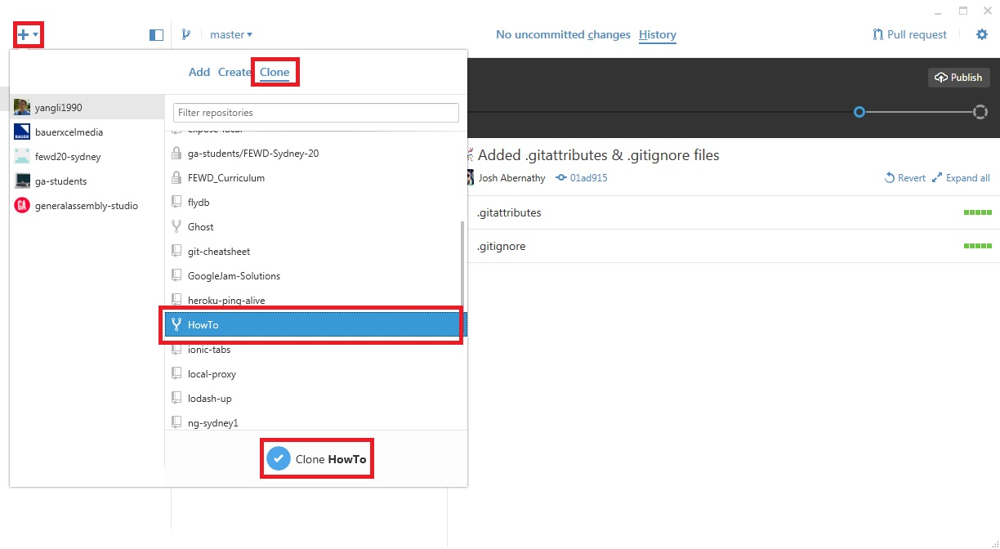
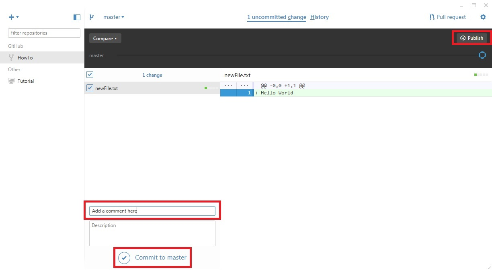
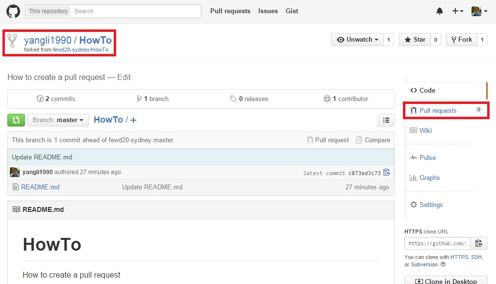
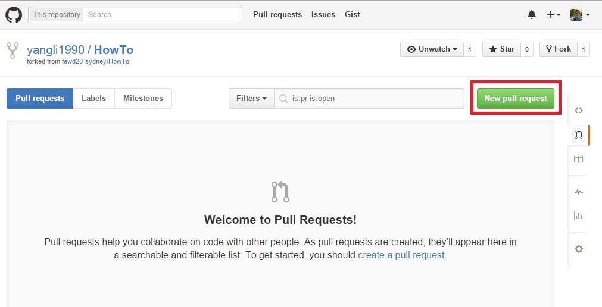
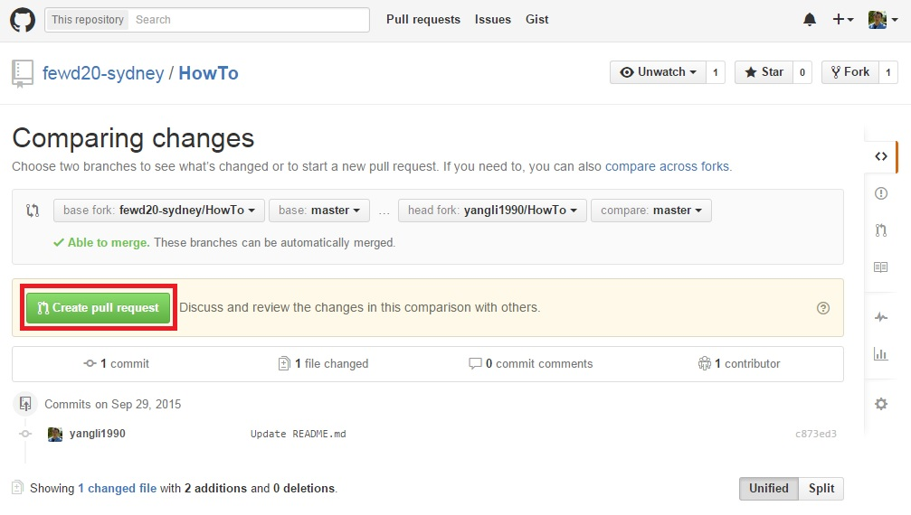
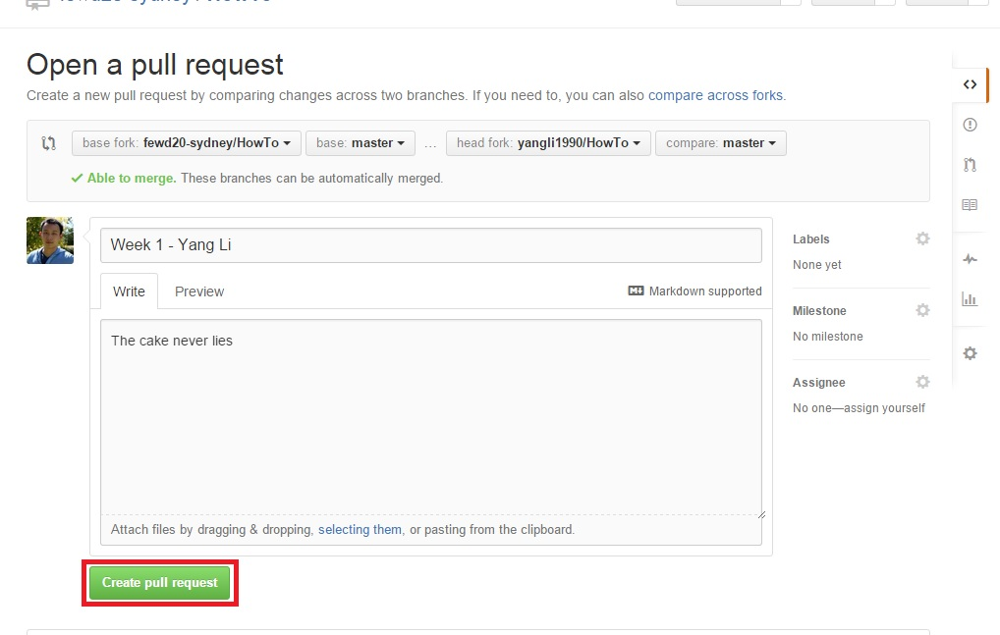

# How To Create A Pull Request

##Step 1 - Fork a repo

##Step 2 - Clone on desktop

##Step 3 - Create/Edit a file in the cloned folder

##Step 4 - Commit the file and then Publish

##Step 5 - Create a Pull Request on Github

##Step 6 - Create a New Pull Request

##Step 7 - Create Pull Request

##Step 8 - Fill details in and Create the Pull Request

